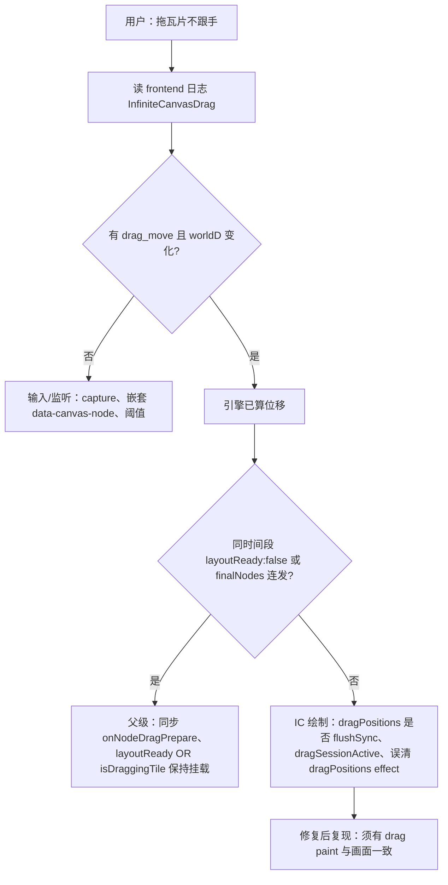

# 排障与日志指南

**文档时间**：2026-05-22T12:00:00+0800（增补 InfiniteCanvas 瓦片拖拽/视口持久化定责专节）

> 排查任何错误、崩溃或异常时，**默认优先打开并分析落盘日志**，以日志为第一手证据对齐时间线与因果链。

---

## 排障工作流（全局，强制）

本仓库**前后端日志均落盘**（见下表），排障须以磁盘文件为权威材料，**禁止盲猜**。

### 第一步 — 先读已有日志

排查任何错误、崩溃或异常时，**默认首先**检索落盘日志，对齐时间线、阶段标识、错误栈与请求链；**不得**在未阅读相关日志的情况下仅凭直觉断定根因。

| 构建 | 日志目录（SSOT · INV-LOG-DIR-01） |
|---|---|
| **开发**（`cargo tauri dev`） | 项目根 **`logs/`**（`CARGO_MANIFEST_DIR` → 父目录） |
| **安装版 / release** | **`{app_data}/logs`**（Windows 常见 `%APPDATA%\bgxiong-ai-story\logs`；与 `PlatformPaths::logs_dir` 一致） |

文件命名：`bgxiong-ai-story-YYYY-MM-DD-HHMMSS.log`（Rust `tracing`）、`frontend-YYYY-MM-DD-HHMMSS.log`（前端经 Tauri 写入）。**禁止**再假设安装版日志在「exe 旁」或「当前工作目录 `logs/`」。

提交「错误报告」时客户端会打包**今天+昨天**匹配文件，并**强制纳入最近一次启动**的前后端会话日志（见 PLAN `20260717T161500+0800-PLAN-BUG报告空日志…`）。若包内 `logFiles` 仍为空，先查 `{app_data}/logs` 是否可写，再定责业务。

### 第二步 — 无日志或不足时再补日志、复现、再分析

若相关链路**没有**落盘记录，或现有记录**不足以**定责，**禁止**继续空转猜测；须先在对应代码路径补充**写入硬盘**的、带**可检索固定前缀**的足够细粒度日志（后端 `tracing::info!` / `warn!` 等，必要时提高模块 `RUST_LOG`；前端统一走 **`ui/src/utils/logger.ts`**），**复现问题一次**，再据**新产生的日志**分析。补日志后再回到第一步。

### 第三步 — 交叉验证

落盘日志仍不足时，再结合断点、网络与厂商响应、DB 状态等多维证据；仍应与日志结论**相互印证**，避免单一维度误判。

### 新增排障用日志规范

应包含：阶段或请求标识、关键上下文、完整错误信息、**可检索的固定前缀**；含密钥或隐私须脱敏；避免无意义高频刷屏。

### BUG 修复：禁止兼容兜底（全局，强制）

与「先读日志、禁止盲猜」并列。**不得**用兼容层、兜底分支或拦截重复来「让现象消失」；须据日志消除根因，**允许破坏性修改**。

#### 语义边界（防误读 · 2026-07-23 钉死）

**「禁止兼容兜底」≠ 砍功能、≠ 程序脆弱、≠ 少写错误处理。**

| 要的 | 不要的 |
|------|--------|
| **健壮 / 鲁棒**：契约清晰、边界校验、失败回到安全态 | 靠旁路「凑合能用」掩盖根因 |
| **错误显式**：用户可见 toast / 任务失败态 / 可检索 `tracing`/`logger` | 空 `catch`、悄悄换路径、默默跳过 |
| **功能完整**：承诺能力开箱可用，覆盖合法输入 | 以「禁兜底」为借口半截实现、无响应 |
| **单路径 SSOT** | 长期 legacy+new 双写 |

合法（**不是**兜底）：输入校验、扩展名+MIME 双判、显式重试、busy 门闩、失败清理半成品并 toast。  
非法：吞错装成功、静默换模型/通道、叠 listener 再用 dedupe 压住。

| 严禁 | 须改为 |
|------|--------|
| `requestId` 去重 / localStorage 抢占 / 内存 `Set` 跳过重复执行 | 拆掉叠 listener、双发入口、广播事件改定向、副作用移出 React effect |
| 新旧双路径长期并存 | 删旧路径或一次性迁移，禁止默认走 legacy |
| catch 后静默换通道/默认值 | 显式失败 + 日志；用户或 UI 可感知 |
| 借「禁兜底」删合法能力 | 不支持则产品明示 + toast；支持则把唯一路径做完整 |
| 程序内 SQLite 兜底 ALTER | `scripts/` 离线迁移（见 AGENTS） |

**自检**：去掉所有 dedupe/静默旁路后 BUG 是否仍会出现？失败时用户是否一定能感知？承诺功能是否仍完整？

**案例**：全局助手提示词模式一次发送触发多次 AI——根因为 React `useEffect` 内 `listen` 叠注册 + `emit` 广播；修复为 `main.tsx` 模块级唯一 listener + `emitTo('main')`，删除 dedupe/claim。详见 **`docs/dev/fixes/FIX-BUG-20260607.md` BUG-008**。

Cursor 硬规则：`.cursor/rules/bug-fix-no-compat-fallback.mdc`（`alwaysApply: true`）。

---

## 日志文件位置（统一存放）

| 日志类型 | 文件路径 | 说明 |
|---------|---------|------|
| 后端日志 | `logs/bgxiong-ai-story-YYYY-MM-DD-HHMMSS.log` | Rust `tracing` 每次进程启动新建一个文件 |
| 前端日志 | `logs/frontend-YYYY-MM-DD-HHMMSS.log` | 前端通过 Tauri 命令写入，每次初始化新建一个文件 |
| 前端日志实现 | `ui/src/utils/logger.ts` | 异步缓冲，2秒/100条批量写入 |
| 后端日志实现 | `src-tauri/src/log_init.rs` | `tracing_appender` 非阻塞写入 |

**开发模式保留历史日志**：`debug` 构建（`cargo tauri dev`）每次进程启动会创建新的 `bgxiong-ai-story-*.log` / `frontend-*.log`，**不会**删除近期旧文件，便于跨多次重启排障。仅删除修改时间早于 **35 天** 的项目日志（与生产模式相同，`disk_cleanup::LOG_RETENTION_DAYS`）。

**生产模式**：不启动清空；仅删除修改时间早于 **35 天** 的项目日志（`disk_cleanup::LOG_RETENTION_DAYS`）。

**注意**：前后端日志统一存放在 **项目根目录 `logs/`** 下，便于排障时全链路追踪。开发模式下若日志未生成，检查 `src-tauri/logs/`（旧位置）并手动迁移。

---

## 典型案例：本地图片不显示 · `asset.localhost` / asset 协议（2026-04）

本条记录**真实排障顺序**，避免下次从「PNG 坏了 / WebView 随便拦」等惯性猜因。

### 现象

演员参考图、肖像等到本地路径的 `` 不显示；或浏览器里 **`asset.localhost` 拒绝连接 / 403**。

### 排障步骤

1. **第一层（前端路径）**：库内若存的是**相对路径**（如 `portrait_cache/...`），不能直接 `convertFileSrc`；须 **`resolve_app_data_media_path`**，前端用 **`api.mediaSrcFromAppDataRelative`**（含 resolve 失败回退）。若只做这一层仍不显示，**不要**停在「路径错了」。

2. **第二层（日志定责）**：查 **`logs/bgxiong-ai-story.log*`** 是否有 **`tauri::protocol::asset: asset protocol not configured to allow the path`**。有则**一定是 asset 白名单**，不是图片格式问题。

3. **第三层（Windows 路径形态）**：日志里若出现 **`\\?\`** 前缀，**`resolve_under_app_data`** 侧用 **`dunce::canonicalize`** 替代裸 **`std::fs::canonicalize`**，减少与 scope 匹配不一致。

4. **第四层（配置陷阱）**：**不要**依赖 **`tauri.conf.json`** 里 **`$EXE/../../../data/**`** 这类带 **`..`** 的静态 scope —— Tauri **`PathResolver::parse` 会丢弃 `..` 段**，该模式**无法**指向仓库根下 `data/`（开发机常见 **`F:\...\项目\data`**）。

5. **落地修复（本仓库已验证）**：在 **`main.rs` `setup`** 对 **`paths::app_data_dir()`** 调用 **`app.state::<tauri::Scopes>().allow_directory(&app_data_dir, true)`**，用**运行时真实数据根**递归放行；启动日志应有 **`startup: allowed app_data_dir in asset scope`**。改完后须**重启桌面进程**（非仅热更新前端）。

6. **关联**：Windows 上若 HTML5 拖拽文件不可靠，主窗口 **`dragDropEnabled: false`** 与参考图区自管 **`drop`** 的搭配见 **`CharacterTab`** / `tauri.conf.json`；与 asset 放行是**不同维度**，需分别满足。

---

## 典型案例：重启后图片消失 · orphan 清理误删（2026-05）

### 现象

生图/导入成功，重启后 UI 不显示；SQLite 中 `portrait_versions` / `image_versions` 仍有 `localCachePath`，磁盘 PNG 已不存在。

### 第一步 — 日志定责

在 **`logs/bgxiong-ai-story-*.log`** 检索：

```text
startup: removed orphan media files
```

若 `removed` > 0 且时段紧接在用户生图之后 → **orphan 清理误删**，不是生图失败。

### 根因类型（两类，勿混）

| 类型 | 历史 BUG | 机制 |
|------|----------|------|
| 路径键不匹配 | `BUG-2026-04-15-005` | DB 相对路径与扫盘绝对路径对不上 |
| 引用源未登记 | `BUG-2026-05-25-003` | 新表/新列写盘但未加入 `collect_referenced_portrait_cache_paths` |

### 修复与预防

- **代码 SSOT**：`src-tauri/src/infrastructure/persistence/sqlite/orphan_reference_repository_sqlite.rs` 头注释登记表；清理实现见 `src-tauri/src/disk_cleanup.rs`
- **合并门禁**：`AGENTS.md`「本地媒体落盘 ↔ 启动 orphan 清理」；DATA **`20260523T203000+0800-DATA-视觉资产image_versions与PortraitVersion契约.md` §3.3**
- **验收**：生图 → 重启 → 日志 `orphan media scan — nothing to remove`

### 数据恢复

已被删文件**无法**从 DB 元数据自动还原，须重新生图或从备份目录取回 PNG。

---

## 典型案例：启动失败 · `init_schema` · `ai_tasks` 缺列（2026-05）

### 现象

桌面端启动即 panic / 日志中出现 **`no such column: story_id`**，SQL 片段含 **`CREATE INDEX … idx_ai_tasks_story ON ai_tasks(story_id, …)`**。

### 根因（一句话）

磁盘上已有**旧版** `ai_tasks` 实体表且列不全；`CREATE TABLE IF NOT EXISTS` **不会**重建该表，后续建索引仍引用新列名 → 报错。

### 处理顺序

1. 打开 **`logs/bgxiong-ai-story.log*`**，检索前缀 **`DB INIT SCHEMA:`**（`schema.rs` 在失败时会 `tracing::error!` 打出可操作说明）。
2. 按 **`AGENTS.md`**「清库/清配置前临时备份」备份 **`data/story.db`**（及同目录 **`story.db-shm` / `story.db-wal`** 若存在）。
3. 删除主库文件后重启；或按 **`docs/dev/plans/20260509-PLAN-旧库迁移或清库启动修复计划.md`** 做离线迁移（本仓库默认策略为清库，不写运行时兼容分支）。

---

## AI 最终提示词 · 代码汇聚点（审计清单）

以下路径在发起请求前已调用 `dev_log_final_prompt` 或已有等价的 `tracing::info!`（含完整 `final_prompt` / `final_request_body`）。**新增调用须对齐本条**；若在此处新增分支，请同步更新本清单。

| 类型 | 主要入口 / 文件 |
|------|-----------------|
| 文本（OpenAI 兼容） | `open_platform/text.rs` → `chat_completion`（含 `final_request_body` + `dev_log_final_prompt`） |
| 文本（通义千问） | `open_platform/qwen.rs` → `qwen_chat_completion` |
| 文生图 / 图生图（统一入口） | `open_platform/image.rs` → `generate_image` → `dev_log_final_prompt`；火山引擎兼容另见 `AI images/generations: final_prompt` |
| 图生图 · 火山人像写真 | `open_platform/volc_i2i_portrait.rs` → `generate_i2i_portrait_v3` |
| 即梦 T2I 智能视觉 | `open_platform/volc_jimeng_t2i_visual.rs` |
| 万相图像 | `open_platform/dashscope_wan_image.rs` |
| 可灵图像 | `open_platform/kling_image_generation.rs` |
| 视频（即梦 T2V / OpenAPI） | `open_platform/video.rs` → `submit_text2video` / `submit_text2video_openapi` |
| 语音合成（TTS） | `open_platform/tts.rs` |
| 场景图 / 分镜图（业务层） | `scene_concept_image_pipeline.rs` → `run_generate_scene_concept_image` / `run_generate_segment_storyboard_image` |
| 分镜视频 | `segment_video_pipeline.rs` → `run_generate_segment_video` |
| 演员单张肖像 | `cast_portrait_still_pipeline.rs` → `run_generate_cast_portrait_still` |
| 演员四视角形象 | `actor_portrait_pipeline.rs` → `run_generate_actor_portrait` |
| 角色定妆图 | `role_portrait_pipeline.rs` → `run_generate_role_portrait` |
| 角色定妆提示词生成 | `commands.rs` → `generate_role_portrait_prompt` |
| 剧集生成管线 | `story_chapter_pipeline.rs` → `chat_bundle`（含 expand_seed / plan_chapters / nfp_review / nfp_rewrite / extract_bible / format_roles_expert） |
| 场次故事板管线 | `chapter_scene_board.rs` → `chat_bundle`（含 `story.plan_scenes_from_chapter` / `story.storyboard_semantic_shots` / `scene.concept_art_prompts` 等） |
| 生图提示词压缩 | `image_gen_prepare.rs` → `compress_prompt_for_image_cap` |
| 演员视觉提炼 | `commands.rs` → `extract_actor_portrait_visual_hints` |
| AI 自由对话 | `commands.rs` → `ai_chat_completion` |
| 本地文本 | `commands.rs` → `local_text_generation` |
| 本地语音识别 | `commands.rs` → `local_speech_recognition`（输入摘要，见总规则「例外」） |

### 文本类 AI 任务记录要求

详见 **[GUIDE-AI任务提示词落库规范.md](GUIDE-AI任务提示词落库规范.md)**（双通道：logs + `ai_tasks.last_payload`）。

- 必须在发起请求前记录完整的 `system` + `user` 消息组合（或等价的最终提示词文本）
- 优先调用 `dev_log_final_prompt`，或在同一请求前打出等价的 `tracing::info!`
- 同步更新 AI 任务进度（`ai_task::update_progress_merge`），将 `finalPrompt` / `systemPrompt` / `userPrompt` 写入任务 payload
- 生成完成后，将生成的结果（如 `generatedPrompt`）也记录到任务进度中

### 排障多维度对齐

后续接新厂商或改现有调用时，**出错排查与 `tracing` 日志须多维度对齐真实请求**，避免惯性只盯「有没有 API Key」或只看内部 `provider` 字符串。

- **鉴权方式不止一种**：同一产品内的「文生图」可能走 Bearer **`api_key`**，也可能走火山 **IAM（Access Key ID + Secret Access Key）** 等。命令层/管线层日志**按通道记录实际用到的凭证维度**（如 IAM 通道记录脱敏 AK、`has_secret_access_key`，勿只打 `api_key_masked` 导致恒为 `(empty)` 误判未配置）。
- **内部标识 ≠ 协议常量**：应用内 `backendId` / `ImageProviderKind::as_str()` 可能与厂商 Body 里的 **`req_key`、Action、Version** 不同（例：**即梦 4.6** 智能视觉固定 **`req_key=jimeng_seedream46_cvtob`**，**不是** `jimeng_t2i_v46`）。日志与排障应能对照**请求里真实下发的协议字段**。
- **多步骤链路**：先 **Submit** 再 **Poll/GetResult** 的接口，失败可能发生在任一步或任一轮轮询；**勿**仅凭第一条 HTTP 日志定论。
- **改代码时的自检清单**：对照官方文档核对 Host、Query（Action/Version）、鉴权算法、Body 字段名与枚举；用户报错时依次考虑 **网络/TLS、签名与时钟、endpoint 与区域、配额与限流、业务错误码、`req_key`/模型/尺寸等业务参数**，避免只改一处就认为排除完毕。

---

## 历史脏数据修复脚本

对于「SCENE_ENV 块在 Storyboard 之后」的历史脏数据（应用已通过 `SCENE_ENV_BLOCK_ORDER_VIOLATION` 日志告警），提供离线一次性修复脚本：

- **PowerShell**：`scripts/offline_fix_scene_env_block_order.ps1`（需 .NET SQLite 驱动，见脚本内说明）
- **Python（推荐）**：`scripts/offline_fix_scene_env_block_order.py`（仅需标准库 `sqlite3`）

用法（仓库根目录）：
```bash
# 仅扫描，不修改
python scripts/offline_fix_scene_env_block_order.py --dry-run

# 实际修复（执行前自动备份到 data/backups/）
python scripts/offline_fix_scene_env_block_order.py

# 指定数据库路径
python scripts/offline_fix_scene_env_block_order.py --db-path data/story.db
```

备份位置：`data/backups/story.db.pre_env_block_reorder.<时间戳>.bak`。

---

## 角色定妆照 · 任务 finalPrompt 与镜头语言检索表

> 2026-05-18 新增：配合「最终提示词可见 + 镜头语言生效」链路修复。

| 排查目标 | 检索方式 | 说明 |
|----------|----------|------|
| 最终送审提示词 | AI 任务详情 → `finalPromptSent`（标量 string） | 出图成功后写入；与 `logs/` 中 `AI DEV FINAL PROMPT` + `job_id` 一致 |
| 融合/定稿稿 | AI 任务详情 → `finalPromptNatural` | 定稿后写入；自然语言版本 |
| 域内正文 | AI 任务详情 → `finalPromptRaw` | 融合前的原始域提示词 |
| 镜头语言参数 | AI 任务详情 → `shotScale` / `styleDomain` / `camera` / `aspectRatio` | `mark_submitted` 时写入；`shotScale` 如 `close_up`、`camera` 含 `focalLengthTendencyId` + `apertureStyleId` |
| 编译后短语 | `finalPromptSent` 尾部；或 `compiledProductLanguageSuffix` | `prompt_compiler::compile` 追加的英文短语；runner 在 HTTP 前将后缀单独写入 payload 便于对照 |
| 文件日志 | `logs/bgxiong-ai-story.log*` 检索 `AI DEV FINAL PROMPT` | 含 `role_node_id` / `job_id` / `provider` / `model`；权威对照 |
| 列表轮询 | AI 任务列表（IPC） | `finalPrompt*` 已被 `omit_heavy_payload_keys` 剥离，不进列表 payload |

**常见问题**：
- **看不到最终提示词** → 检查任务是否为 P0 修复后创建；旧任务（omit 时代）`last_payload` 已 strip，无法补数据，可依赖 description 回退
- **镜头语言似乎没生效** → 对照 `finalPromptSent` 尾部是否含对应英文短语（如 `close-up`、`telephoto lens`）；若不含，检查弹层「自动」是否正确回填 registry 默认
- **failed/cancelled 任务无 prompt** → 详情读 `resultJson.lastPayload`（P1-4 兼容）；更早版本无此回退

---

## 布局持久化（分栏 + 弹层）跨重启 · 检索表（强制先对账）

> **专题 SSOT**：`docs/dev/guides/20260521T180000+0800-GUIDE-布局持久化跨重启排障与开发约束.md`（含根因分类、开发约束、禁止瞎猜清单）。  
> 弹层 PLAN：`20260520T173000+0800-PLAN-全仓弹出层统一入口与几何记忆-原子级开发计划.md` **§1A.7**。  
> BUG 时间线：`FIX-BUG-20260521.md` **BUG-018～029**。

### 现象 → 禁止的第一反应

| 用户描述 | 禁止瞎猜 | 应先做的日志对账 |
|----------|----------|------------------|
| 重启后弹层/分栏都回默认 | 「没记拖拽」「读错键」「SQLite 没写」 | 同一次启动：`reload read layout` vs `MODAL_FRAME_PRELOAD` |
| 同会话正常、仅重启丢 | 只改视频 Host / 只改侧栏组件 | 查 **029 内存污染**（render 阶段 register + preload 不覆盖） |
| 有 commit、有 flush，重启仍默认 | 「后端没落库」 | ① 两行启动日志是否不一致；② 不一致 → 029，一致仍丢 → React hydrate |

### 检索键

| 排查目标 | 检索方式 | 说明 |
|----------|----------|------|
| **磁盘（SQLite）** | `[AppSettingsV4] reload read layout from SQLite` | 含 `videoWorkbenchFrame`；**跨重启权威** |
| **内存（preload）** | `MODAL_FRAME_PRELOAD_VIDEO_WORKBENCH` | 含 `frame`、`sidebarWidth`、`videoShellLeftWidth`；须与上一行一致 |
| 落盘 commit（内存） | **`MODAL_FRAME_PERSIST`** + `commit` | **≠** 跨重启已持久化 |
| 打开恢复 | 同前缀 + `hydrate_restore` / `hydrate_fallback` | 读 **内存 store**，非直接读 SQLite |
| 立即写库 | `layout.flushExtensionsNow` + `videoWorkbenchFrame` | 须 **await** 链完成（028 串行化） |
| 合并 layout | `layout.writeLayoutStates` | 脏 workspace 写入 extensions |
| 磁盘路径 | `extensions.layoutStateV1.workspaces.<layoutId>.items.<itemId>.value` | 分栏例：`app.main.shell` / `split.leftSidebarWidth` |

### 定责口诀

1. **`reload` 自定义、`preload` 默认** → 启动污染 `workspaceStates`（**BUG-029**），修 store/preload/注册时序，勿改业务弹窗文案。  
2. **两者都默认、操作后有 flush** → IPC 竞态或未 await（**BUG-028/024**）。  
3. **两者都自定义、UI 仍默认** → `hydrate_fallback` 或组件 state 未同步。

---

## 弹窗几何持久化 · MODAL_FRAME_PERSIST 检索表

> 配合 §上一节「布局持久化跨重启」；细节 §1A.7 与 BUG-002。

| 排查目标 | 检索方式 | 说明 |
|----------|----------|------|
| 落盘 commit | `logs/frontend-*.log` 检索 **`MODAL_FRAME_PERSIST`** + `commit` | 仅证明内存 store 更新 |
| 打开恢复 | 同前缀 + `hydrate_restore` | 从 preload 后的内存 store 读回 |
| 防降级跳过 | 同前缀 + `commit_skipped_preserve_custom` | 阻止 catalog 默认覆盖库内自定义 |
| 磁盘 SSOT | SQLite → `layoutStateV1.workspaces.modal.app.frames.items.<layoutItemId>` | 与 `reload read layout` 一致 |

**常见问题**：

- **缩放后切 Tab 再开回到默认尺寸** → mount-close 用默认覆盖（BUG-002 / §1A.7）。  
- **重启后丢失、同会话正常** → **必须先做「reload vs preload」对账**（BUG-029），见专题 GUIDE。  
- **关窗后立刻杀进程丢几何** → 须 `flushExtensionsNow` await；`forceQuit` 仅短超时尽力 flush（BUG-024/027）。

---

## 生图参数提交 · IMG_GEN 检索表

> 2026-05-19 新增：配合「生图参数以 UI 提交为准」PLAN（`20260518T234500+0800-PLAN-生图参数以UI提交为准-全仓对齐与规范固化.md`）。

| 排查目标 | 检索方式 | 说明 |
|----------|----------|------|
| 前端提交合同 | `logs/frontend-*.log` 检索 **`IMG_GEN_SUBMIT`** | 字段含 `aspectRatio` / `resolutionId` / `outputPresetMode` / `shotScale` / `styleDomain` / `camera`；**以之为准**，禁止用旧 `invoke.payload.summary` |
| 重复点击确认 | 检索 **`IMG_GEN_SUBMIT_DUPLICATE_BLOCKED`** | Workbench 或角色定妆重复提交被拦截 |
| 后端厂商尺寸 | `logs/bgxiong-ai-story.log*` 检索 **`IMG_GEN_API_SIZE`** | `aspect_ratio` / `api_size` / `resolution_id`；须与 `IMG_GEN_SUBMIT` 同任务一致 |
| 任务页摘要 | AI 任务详情 → `last_payload.submitted_generation` / `submitted_product_language` | `mark_submitted` 写入；列表轮询已剥离重字段 |
| 非 packet 例外 | 检索 **`IMG_GEN_NON_PACKET_EXCEPTION`** | 如章节 `chapterKeyArt` 仍走 `api.generateImage`；登记 kind + 入参摘要，**不**当作 packet 合同 |
| 已废弃 last 画幅 | 检索 **`LAST_ASPECT_RATIO_DEPRECATED_IGNORED`** | 旧 `lastAspectRatioPreference` 被忽略，不得参与 submit |

**常见问题**：

- **UI 9:16、日志 1:1** → 对照同 trace 的 `IMG_GEN_SUBMIT` 与 `IMG_GEN_API_SIZE`；若前端已是 1:1，查 combined preset / 双 state；若前端 9:16、后端 1:1，查 submit 后静默覆盖或 extensions 通道（T2I vs I2I）。
- **任务页与成片不一致** → 以任务创建后的 `submitted_*` 为准；旧任务无该字段不可补写。

---

## 分镜 Stage B 摄取 · STORYBOARD_STAGE_B_INGEST 检索表

> 2026-05-19 新增：配合 `20260518T211500+0800-PLAN-分镜StageB与场次管线LLM输出鲁棒性重构计划.md`。

| 排查目标 | 检索方式 | 说明 |
|----------|----------|------|
| Ingest 失败 | `logs/bgxiong-ai-story.log*` 检索 **`STORYBOARD_STAGE_B_INGEST`** | `phase` 多为 `validate_shots` / `ingest`；含 `diagnostics_count` |
| Repair 温度回退 | 检索 **`STORYBOARD_REPAIR_TEMP_FALLBACK`** | attempt≥2 温度 0 失败时回退 bundle 温度 |
| 任务进度/详情 | AI 任务 `lastPayload.stageBIngestDiagnostics` | 元素：`ruleId` / `path` / `action` / `severity`；剧集/单场分镜任务详情区展示 |
| 子任务摘要 | 子任务 `storyboard_render` / `storyboard_render_batch` 的 `finish_done` summary | 含同名字段，便于对照单场 Stage B |
| Tera 补缺 | 检索 **`STORYBOARD_FINAL_PROMPT_SOURCE=deterministic_template`** | repair 耗尽后按镜索引 TPL；对照 `test_fixtures/tera_golden_prompt.txt` |
| 连戏摘要 | **非** ingest 职责 | `PreviousShotRenderSpecSummary` 由 `scene_shots_pipeline` 逐镜循环维护；ingest 不合并上一镜摘要 |

**常见问题**：

- **ingest 有 warn 但任务完成** → `stage_b_ingest_partial`；对照 diagnostics 中 `B_RELOC_*` / `B_DEFAULT_*` / `B_TPL_*` 规则 id。
- **repair 多轮仍失败** → 查最后一轮 `format_repair_user_message` 是否含 ingest 摘要（TB-09b）；勿静默改模型或通道。

---

## InfiniteCanvas 瓦片拖拽不跟手 / 松手才瞬移 · 定责 playbook（2026-05-22，BUG-017 验证）

> **代码入口**：`ui/src/infinite-canvas/InfiniteCanvas.tsx`；瀑布流父级：`SceneCanvas` / `useSceneCanvasLayout`、`useCastPortraitCanvas`。  
> **BUG 记录**：`docs/dev/fixes/FIX-BUG-20260522.md` **BUG-2026-05-22-017**。

### 现象 → 禁止的第一反应

| 用户描述 | 禁止瞎猜 | 日志第一步 |
|----------|----------|------------|
| 拖瓦片不跟手、松手才跳到鼠标处 | 「window 丢了 mousemove」「WebView2 事件丢失」 | 统计 `[InfiniteCanvasDrag]` 会话是否**有** `drag_move` |
| 拖动时其它图复位 / 瀑布流乱跳 | 先改 masonry 算法 | 同会话是否有 `[F5] SceneCanvas finalNodes` 连发、`layoutReady:false` |
| 失焦回焦后**首次单击**节点小跳 | 提高 drag 阈值 / 点击 dedupe | `container_width_sync`（`pointer_pre`）是否早于 `drag_prepare`；是否违反 **INV-MASONRY-DRAG-06**（FIX **`FIX-BUG-20260612.md`**） |
| 平移缩放后重进 Tab 视口回默认 | 「localStorage 没写」「persist 坏了」 | `CANVAS_PERSIST` 的 `localStorage read` / `syncState` 里 `panX`/`scale` 是否已是用户值 |

### 检索键（`logs/frontend-YYYY-MM-DD*.log`）

| 排查目标 | 检索方式 | 定责含义 |
|----------|----------|----------|
| 拖动会话链 | **`InfiniteCanvasDrag`** 或 **`drag paint`** | 单次拖动：`mousedown` → `drag_start` → 多条 `drag_move` → `mouseup_commit` → `end` |
| 引擎有位移、画面无 | 有 `drag_move` 且 `worldDx`/`worldDy` 递增，仍不跟手 | **输入层正常** → 查 **React 绘制**（`dragPositions`、`layoutReady` 卸载 IC、父级 nodes 未冻结） |
| 引擎无位移 | `mousedown` 后直接 `end`，或 commit 前**无** `drag_move` | 查 capture 监听、嵌套 `data-canvas-node`、`disabled`、阈值未过 |
| 父级冻结 | **`[SCENE_CANVAS] drag prepare`** / cast 同类 | 须在 **mousedown 同步** 触发，不能只在 `onDragStateChange(true)`（8px 后） |
| 失焦首次单击 / 宽度积压 | **`container_width_sync`** · **`container_width_pending`** · **`container_width_release_flush`** | `pointer_pre` / `focus_flush` 应早于 `drag_prepare`；纯单击不应有 `container_width_pending`；mouseup 后 `layout_commit` 坐标大变 → **INV-MASONRY-DRAG-06**（FIX **`FIX-BUG-20260612.md`**） |
| 视口落盘 | **`CANVAS_PERSIST`** + `storageKey`（如 `bgxiong_scene_canvas_v3:<sceneId>`） | `localStorage read: ok` 的 `panX`/`panY`/`scale`；`syncState skipped: persist not loaded yet` |
| 视口恢复 | **`[F8] sceneCanvas persist hydrate sync`** | `hasSnap:true` 且 viewport 与 read 一致；若 UI 仍默认而日志已 custom → `layoutReady:false` 时 IC 未挂载 |

### 定责决策树（先日志、后改码）



### 会话统计（PowerShell 项目根，替换日志文件名）

```powershell
# 统计：有 mousedown+commit 但无 drag_move 的会话数（应为 0 才支持「绘制层」定责）
python -c "
import re,json
from collections import defaultdict
path=r'logs/frontend-2026-05-22-023053.log'  # 改成当日文件
pat=re.compile(r'\[InfiniteCanvasDrag\].*\| (\[.+\])')
s=defaultdict(list)
for line in open(path,encoding='utf-8',errors='replace'):
    if 'InfiniteCanvasDrag' not in line: continue
    m=pat.search(line.strip())
    if not m: continue
    try: arr=json.loads(m.group(1))
    except: continue
    ev,data=arr[0],arr[1] if len(arr)>1 else {}
    seq=data.get('seq',0)
    s[seq].append(ev)
no_move=sum(1 for evs in s.values() if 'mousedown' in evs and 'drag_move' not in evs and ('mouseup_commit' in evs or 'end' in evs))
print('sessions',len(s),'no_drag_move_but_commit',no_move)
"
```

### 已验证修复清单（绘制层根因时）

1. **`onNodeDragPrepare` 在 mousedown 同步调用**（禁止 `queueMicrotask` 延迟冻结父级 nodes）。
2. **`flushSync` 写入 `dragPositions`**（避免与父级 `setState` 批处理合并后仅松手才绘制）。
3. **`dragSessionActive` state** 参与 `isNodeDragActive` / `bypassWindowingForDrag`（不单独依赖滞后 `draggingId`）。
4. **拖动中** `useEffect` 清理 `dragPositions` 须判断 `dragSessionActive` / `dragStateRef`。
5. **节点拖动** capture `mouseup` 单路径 `commit`（`dragCommitHandledRef` 防 window `mouseup` 重复）。
6. **DOM**：仅 **外层** IC 包装保留 `data-canvas-node`；瓦片内层用 **`data-node-tile`**（避免 `closest` + `setPointerCapture` 命中内层）。
7. **场次画布**：`layoutReady || isDraggingTile` 保持 IC 挂载；`persistLoaded` 后再 `syncState`；中键平移结束 `flushNotify`。

### 交付前自检

- `cd ui && npm run build`
- 手测拖瓦片跟手 + 松手不跳其它图
- 新日志含节流的 **`drag_move`** / **`InfiniteCanvasDrag` + `drag paint`**，且 `worldDx` 与肉眼位移同向

---

## 视频提示词 pipeline · 排障检索前缀（2026-06-01）

> **SSOT**：`src-tauri/src/video_prompt_pipeline/` · `ui/src/domain/video-prompt-pipeline/` · PLAN **`20260601T163000+0800-PLAN-全仓视频提示词优化管线-破坏性重构与原子任务.md`**

| 现象 | 优先 grep |
|------|-----------|
| AI 优化失败 / 无指代 token | `VIDEO_PROMPT_PIPELINE` · `stage=lint` · `INV-VID-PROMPT` |
| 最终下发 prompt 审计 | `AI DEV FINAL PROMPT` · `VIDEO_PROMPT_PIPELINE finalPrompt` |
| 右栏无 inventory / generic T2V | `VIDEO_PROMPT_PIPELINE_CTX built` · `inventoryCount` |
| 片段画布右栏 optimize | `SEG_VIDEO_PROMPT_OPTIMIZE invoke_start` · `videoProviderKind` |
| 未知 provider Hard Fail | `视频提示词 pipeline 不支持 provider_kind` |

---

> **专题 SSOT**：`docs/dev/guides/20260528T120000+0800-GUIDE-故事板双栏画布布局与排障经验.md`（架构、重置宽度契约、占位符/src 水合、分栏、日志前缀 playbook）。**凡故事板中间/右侧画布问题，先打开该文档 §5，再 grep 下表前缀。**

| 现象 | 优先 grep（`logs/frontend-*.log`） |
|------|-------------------------------------|
| 历史图长期占位/不显示 | `STORYBOARD_SHOT_HISTORY_SRC` · `CANVAS_MASONRY_LAYOUT layout_commit` |
| 重置后列宽不对 | `reset_layout_remeasure` · `STORYBOARD_SHOT_HISTORY_CANVAS reset layout` |
| 历史拖到工作流（导出拖） | `STORYBOARD_HISTORY_TO_CANVAS_REF` · `InfiniteCanvasDrag mouseleave skip`；playbook **`20260528T120000+0800-GUIDE-故事板双栏画布布局与排障经验.md` §5.6** |
| 工作流视口/重置 | `[STORYBOARD_CANVAS]` |
| 删除后画布闪 loading | `skipFullSegmentRefresh` · BUG-2026-05-28-001 |

---

## 相关文档

- `docs/dev/guides/20260521T180000+0800-GUIDE-布局持久化跨重启排障与开发约束.md` - **分栏/弹层重启丢失**专题（禁止瞎猜清单、reload vs preload 对账）
- `docs/dev/guides/20260528T120000+0800-GUIDE-故事板双栏画布布局与排障经验.md` - **故事板工作流 + 分镜历史双栏**专题（IC 迁移、重置宽度、占位符排障）
- `docs/dev/AI任务提示词记录规范.md` - 详细的提示词记录规范
- `docs/dev/AI任务提示词记录规范-验收报告.md` - 验收报告
- `AGENTS.md` - 项目总规则与开发规范
