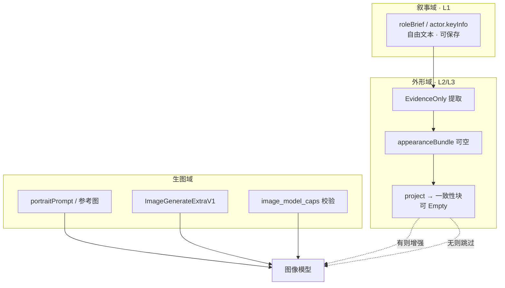

**文档时间**：2026-05-17T26:15:00+08:00

# GUIDE：角色叙事 × 外形摘录 × 生图提交 — 全产品统一设计理念

> **类型**：GUIDE（**理念总纲** · 跨 PLAN 裁决 · 非原子任务清单）  
> **读者**：产品、全体实现角色/演员/故事/定妆/分镜/出图链路的工程师与 AI Agent  
> **地位**：2026-05-17 起，凡涉及「角色简介」「外形」「定妆」「全产品生图弹窗/提交」的设计与代码评审，**先对齐本文**，再打开各专题 PLAN 执行细节。  
> **前提**：与 `AGENTS.md` 一致——未上线、**不兼容旧数据**、**不兜底**、演员为**独立资产**、生图**禁止**未选中接口轮询降级。

---

## 0. 一句话

**叙事给人改、外形只摘录有依据的、生图靠用户定妆合同与模型能力；没依据不编，缺脸相找演员，再没有就交给图像模型。**

---

## 1. 三个领域（禁止混域）

全产品把「角色相关信息」拆成 **三个正交领域**。混域（用简介格式挡生图、用生图 validator 逼用户写年龄）一律视为设计缺陷。

| 领域 | 用户心智 | SSOT / 出口 | **禁止** |
|------|----------|-------------|----------|
| **叙事域** | 「角色简介」= 剧情、性格、关系；系统生成的全文是**提示** | 编辑器中的 `roleBrief` / `actor.keyInfo` | 要求 `【年龄】` 模板才能保存；前端字段级校验 |
| **外形域** | 「外形分析」= 从原文**摘录**；可没有 | `appearance/` → `resolve` + `project` | 无依据时 LLM **填** 具体年龄身高；strict parse 挡落库 |
| **生图域** | 「定妆提示词 + 画幅/分辨率/景别」= **出图合同** | `portraitPrompt` + `buildImageSubmitPacket` + `validate_image_generation_with_snapshot` | 因简介缺脸型拒绝 IPC；无 caps 静默 `3:4` |

**执行文档分工**：

| 领域 | 权威 PLAN |
|------|-----------|
| 叙事 + 外形 | `20260517T241500+0800-PLAN-角色外形与定妆输入-灵活提取与高内聚重构计划.md` |
| 生图 UI + 提交 + 管线编排 | `20260517T235900+0800-PLAN-全产品生图前置条件统一与底层管线-升级改造计划.md` |
| 画幅/分辨率/apiSize（模型域） | `20260517T211500+0800-PLAN-图像模型分辨率真相源与模型驱动生图参数-全量重构计划.md` |
| 视频参数（禁止与图像混用） | `20260517T173000+0800-PLAN-模型驱动生成参数与全产品视频体验一致性-产品设计方案.md` |

---

## 2. 角色简介：两种来源（产品宪法）

| 来源 | 标记 | 行为 |
|------|------|------|
| **系统 / LLM 生成** | `roleBriefOrigin = llm_suggested`（**写一次不变**） | 初稿可较全；UI 作**提示**；任意保存改字 → `roleBriefUserEdited=true`，故事生成 **不得** 覆盖 |
| **用户自编** | `user_authored` | 可**无**年龄、脸型、身高；**合法** |

**共同规则**：持久化以**当前编辑器文本**为准；不是程序解析格式，不是结构化 SSOT。

---

## 3. 外形合并：演员仅锁五官 + 剧情驱动年龄服化道（INV-ROLE-CAST-01~03）

> **2026-06-05 落地**：PLAN `20260605T180000+0800-PLAN-角色定妆演员仅锁五官剧情驱动服化道年龄-优化方案.md`  
> 离线迁移：`scripts/invalidate_appearance_post_role_cast_play_v1.ps1`

| 场景 | 脸 / 五官锚点 | 年龄 / 发型 / 服化道 |
|------|---------------|----------------------|
| 未绑演员 | 从 `roleBrief` / `characterBaseLock` **摘录**；无则 **空** | 从 `roleBrief` / `perChapterKeyInfo` |
| **已绑演员** | **仅**演员 `appearanceTags` / 五官提炼 / hints（**禁止**年龄、发型、服装） | **100% 角色** `roleBrief` 摘录 |
| 用户自编 + 演员有依据 | 演员五官 + 角色 brief 不冲突 | 角色 |
| **全无依据** | **不捏造**；`appearanceBundle = null`；`project` → **Empty** | 同左 |

**投影标题（定妆管线）**：
- `RolePortraitFace` → `【五官锚点】`（仅 tags）
- `RolePortraitCostume` → `【戏内形象】`（年龄、发型、服饰）

**演员 `portraitExtractedHints`**：仅五官/脸型/肤质；**禁止**写入年龄、发型、服装（提炼 prompt + `build_actor_facial_only_text` 后处理）。

**死规定 · 禁止捏造**：不得为「填表」「过校验」「写剧本约束」调用 gap-fill LLM 编造具体五官或数值。用户 brief 里的「未知」保留在叙事域，**不** 写入 bundle。

**废除**（勿在新代码复现）：`20260517T223000+0800-PLAN-故事生成角色外形定位补全` 中的「未知必须由 LLM 推断为具体年龄/身高」。

---

## 4. 生图：定妆合同 vs 简介

| 输入 | 是否生图门禁 | 说明 |
|------|--------------|------|
| `portraitPrompt` / `imagePromptExtra` | **是**（角色定妆主合同） | 用户意图；无则拒绝定妆 IPC（理由：缺定妆意图，**非** 缺年龄） |
| `reference_images` / 参考图 | 否（可选） | 有则 i2i；约束长相 |
| `roleBrief` / `appearanceBundle` | **否** | 仅增强融合/一致性；**不得** 因缺字段 block `generateRolePortraitV3` |
| `imageModel` + `extra.generation` | **是** | 模型域；见图像 SSOT PLAN |
| `shotScale` / `styleDomain` / `camera` | 提交即合同 | 产品域；`prompt_compiler` 统一 NL |

**全无外貌信息但有定妆提示词**：允许出图；跳过 `portrait_fusion`（无脸锚则不融合）；**图像模型**在 prompt + 参考图下完成细节。

---

## 5. 提交前门禁（`assertImageGenerationPreflight`）范围

与 `20260517T235900` 对齐，门禁 **只检查生图域**：

| 检查项 | 属于 |
|--------|------|
| 已选图像/图生图模型、`blockReason` 空 | 生图域 |
| `extra` 与 validator / `---ASPECT---` 一致 | 生图域 |
| 产品域字段在 registry 内合法 | 生图域 |
| 批量项 caps 缺失 → **整批 0 IPC** | 生图域 |
| `roleBrief` 含不含 `【年龄】` | **禁止** 纳入 |
| `appearanceBundle` 为空 | **禁止** 纳入 |
| 演员未提炼 hints | **禁止** 纳入 |

---

## 6. 体验宪法（跨域 · N1–N8）

| # | 条款 | 叙事域 | 外形域 | 生图域 |
|---|------|--------|--------|--------|
| N1 | **模型/规格先行** | — | — | 未选图像模型 → 规格区灰显 |
| N2 | **选项来自真相源** | — | — | 画幅/分辨率 ← catalog；景别/风格 ← registry |
| N3 | **输入自由** | 简介任意非空可存 | — | — |
| N4 | **摘录不编造** | — | EvidenceOnly | — |
| N5 | **演员仅锁五官** | — | 绑演员仅补脸域 tags | 融合仅在有脸锚时；I2I 前置戏内年龄 |
| N6 | **空则交给图像模型** | — | project Empty | prompt 为主 |
| N7 | **提交即合同** | — | — | packet = IPC 唯一字段源 |
| N8 | **高内聚低耦合** | Tab 只编辑 brief | 仅 `appearance::*` | 仅 `image-generation/*` + `image_generation/runner` |

---

## 7. 演员（Cast）与角色（Role）边界

沿用 `AGENTS.md`：

- 演员 **不** 依赖故事存在；角色 **可** 可选绑定演员。
- 演员 `keyInfo` / `portraitExtractedHints` → 外形域 **五官锚点** 来源（**不含**年龄/发型/服装），**不** 承担角色剧情身份。
- 角色 `roleBrief` → 叙事 + 服饰/身份；**不** 因未选故事而禁止管理演员。

---

## 8. 日志与任务（跨域一致）

| 类型 | 要求 |
|------|------|
| 提取 LLM | `dev_log_final_prompt`；前缀 `APPEARANCE_EXTRACT:` |
| 空投影 | `APPEARANCE_PROJECT: empty reason=no_evidence` |
| 生图提交 | `dev_log_final_prompt` + submitted 含 `extra` 摘要 |
| 提取 / 批量外形 | `ai_tasks` 三阶段（与 `AGENTS.md` 一致） |

---

## 9. 文档地图（2026-05-17 冻结）

| 文档 | 状态 | 用途 |
|------|------|------|
| **本文 GUIDE** | **总纲** | 评审、裁决、新人 onboarding |
| `20260517T241500+0800-PLAN-角色外形与定妆输入-…` | **执行** | 契约、`appearance/`、**§8 迁移**、附录 A/B（ProjectionKind + **i18n**）、Phase 0–4 |
| `20260517T235900+0800-PLAN-全产品生图前置条件…` | **执行** | Workbench、packet、runner |
| `20260517T211500+0800-PLAN-图像模型分辨率…` | **执行** | validator、catalog、extensions |
| `20260517T223000+0800-PLAN-故事生成角色外形定位补全…` | **已取代** | 仅历史；禁止执行 strict/gap-fill |
| `AGENTS.md` 模块索引 | 入口 | 指向本文与各 PLAN |

---

## 10. AI Agent 阅读顺序

1. **本文**（理念）  
2. 改角色/故事/分镜一致性 → `20260517T241500`  
3. 改出图弹窗/批量/提交 → `20260517T235900`  
4. 改画幅/分辨率/apiSize → `20260517T211500`  
5. 遇「演员是否必须先有故事」→ `AGENTS.md` Cast 规则  

**冲突**：叙事/外形以 `241500` 为准；生图 UI/管线以 `235900` 为准；厂商尺寸以 `211500` 为准；三者与本文冲突时 **以本文 §1–§5 为准** 并回头修订专题 PLAN。

---

## 11. 迁移与摘录（摘要 · 细节见 241500 §8）

| 项 | 裁决 |
|----|------|
| 旧 `roleKeyInfo` | **原样** → `roleBrief`；**不** 解析为 `【年龄】` 模板 |
| 旧 `physiqueProfile` | 丢弃；`appearanceBundle=null` |
| 演员 `portraitExtractedHints` | **保留**；迁移后按需重摘录 |
| 备份 | `data/backups/`（**gitignore**，禁止提交） |
| 摘录落库 | 无 `evidenceSpans` 的字段 **丢弃**；提取失败 **保留** 旧 bundle |
| 演员变、角色 brief 不变 | cascade → `reason=actor_binding`；**仅 re-merge**；成功后 `appearanceExtractStatus=merged` |
| 空 brief 迁移 | `appearanceStale=false`；三 digest=`""`；`extractStatus=idle` |
| `both` | **仅** 同一次保存 narrative+演员 digest **同时变**；禁止滥用 |

---

## 12. `resolve` 与 stale（摘要）

| `StaleHandling` | 谁传 | 行为 |
|-----------------|------|------|
| `ProjectOnly` | 定妆、分镜、故事注入 | stale 时 **re-merge**；**不** 角色 extract |
| `AllowRoleExtract` | UI「分析外形」 | 允许 `appearance_extract_role` |

详见 `241500` PLAN **§2.4、§2.11**。

---

**维护**：新增「角色简介/外形/定妆/生图门禁」类需求时，先更新本文 §2–§5，再改对应 PLAN；闭合登记 `docs/dev/需求-YYYYMMDD.md`。
