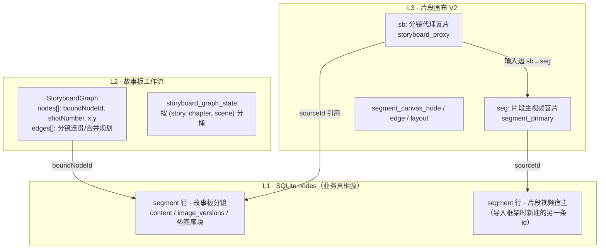
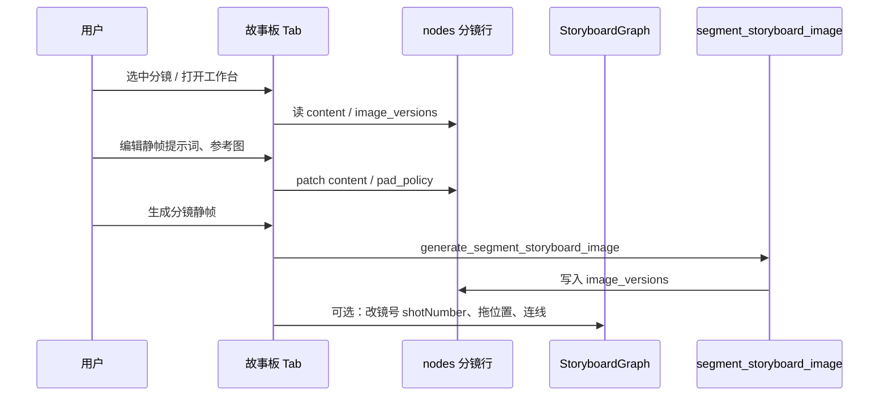
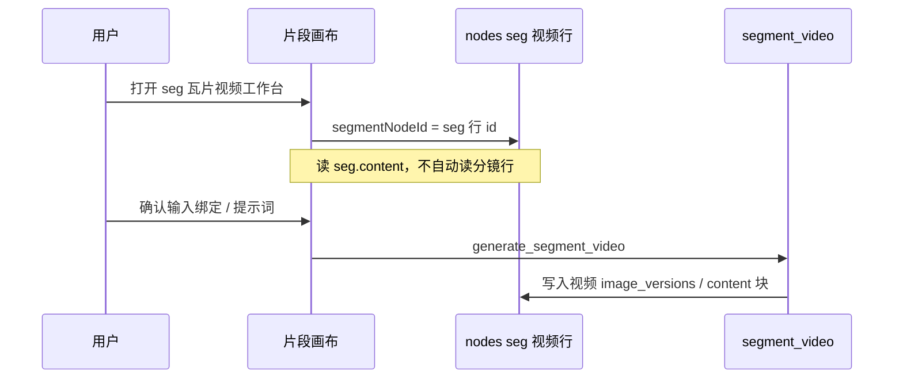

# GUIDE · segment / 分镜 / 片段 — 概念关系与端到端流程

| 项 | 说明 |
|----|------|
| **文档性质** | 面向研发与 Agent 的**流程型**说明：从故事结构到分镜静帧、再到片段视频与导出 |
| **权威词表** | `项目文档/20260509-SPEC-全仓语义命名权威规范.md` |
| **节点关系详文** | `项目文档/20260521T143000+0800-DATA-故事板工作流与片段画布节点关系-引用同步与开发参考.md` |
| **统计口径** | 与仓库 2026-06-22 主分支实现对齐 |

---

## 0. 先读：三个词分别指什么

很多人把「segment」「片段」「分镜」当成同义词，在本项目里**不是**。

| 词汇 | 层级 | 在本项目中的精确含义 |
|------|------|----------------------|
| **`segment`（代码）** | 持久化 | `nodes` 表中 `node_type = "segment"` 的**节点类型名**，全栈唯一，没有单独的 `shot` 节点类型 |
| **故事板分镜（产品）** | 故事板 Tab | 场次内的一镜镜头规划单元：**一颗 segment 节点** + 其在 `StoryboardGraph` 上的卡位、镜号、连线 |
| **片段（产品 · 片段 Tab）** | 片段画布 | 通常指 **`segment_primary` 视频主节点**（画布前缀 `seg:`），用于生成/导出**视频片段**；与「镜号」不是同一套序号 |

记忆口诀：

- **分镜** = 怎么拍、画什么（静帧、提示词、参考图）→ 背后是 **segment 节点**  
- **片段** = 怎么出成片（视频工作流、播放序、导出）→ 画布上是 **`seg:` 主视频节点**（往往对应**另一条** segment 行）

---

## 1. 故事层级（一棵树的 SSOT）

```text
story（故事根 · stories 表）
 └── chapter（剧集 · node_type=chapter）
      └── scene（场次 · node_type=scene）
           └── segment（片段/镜头 · node_type=segment）  ← 全仓最小叙事单元
```

| 代码 | 中文 UI | 典型职责 |
|------|---------|----------|
| `storyId` | 故事 | 工程根、设置、任务列表作用域 |
| `chapterNodeId` | 剧集 | 多场次文本规划、剧集级批量 |
| `sceneNodeId` | 场次 | 场景环境、场次概念图、本场分镜集合 |
| `segmentNodeId` | 分镜 / 镜头（故事板语境） | 静帧提示词、分镜图历史、垫图策略 |

**设计原因（一人一意）**：2026-05 命名收敛后，禁止再发明 `shot` 节点类型；`shot` 只出现在子域名里（`shotNumber`、`scene_shots_plan`），避免 `shot` 与 `segment` 双实体同步。

---

## 2. 两个 Tab：同一批 segment，两种工作台

产品上有两个重度 Tab，底层共享 **L1 业务节点**，但画布持久化**完全分开**。



### 2.1 故事板 Tab —「分镜生产」

| 维度 | 说明 |
|------|------|
| **用户目标** | 规划镜头、写静帧提示词、生分镜图、配参考图、看分镜历史 |
| **画布** | `StoryboardShotCanvas` + `StoryboardGraph` |
| **分镜实体** | `nodes` 中 segment 行；Graph 节点 `boundNodeId` 指向该行 |
| **镜号** | `graph.nodes[].shotNumber` → UI `镜1`、`镜2`（与片段播放序**正交**） |
| **静帧 SSOT** | `nodes.image_versions` + `content` 内 `---STATIC_FRAME_PROMPT---` 等块 |
| **典型 AI 任务** | `scene_shots_plan`（文本规划多镜）、`segment_storyboard_image`（单镜静帧） |

### 2.2 片段 Tab —「视频生产」

| 维度 | 说明 |
|------|------|
| **用户目标** | 把分镜组织成可生成的视频片段、连线、生视频、导出时间线 |
| **画布** | `SegmentCanvasTab` + `segment_canvas_*` 表 |
| **「片段」在 UI** | `seg:` 瓦片，`semanticRole = segment_primary` |
| **分镜在画布上的影子** | `sb:` 瓦片，只读引用故事板分镜（`storyboard_proxy`） |
| **片段播放序** | `segment_play_order` 表 → UI `片段1`、`片段2` |
| **典型 AI 任务** | `segment_video` 及提示词 optimize/compress 链 |

### 2.3 关键：不是画布级复制

- 故事板 Graph 节点 id **≠** 片段画布 `segment_canvas_node.id`
- `sb:` **不是**把分镜再存一份节点，而是 **引用** 分镜 segment 行 + 写入时刻的 **payload 快照**（展示可能滞后于故事板编辑，见 DATA 文档 §7）
- `seg:` 是 **新建的** segment 行，与分镜行 **并列**；多镜可合并进一个 `seg`（见 §4）

---

## 3. 两套序号（故意独立）

| 序号类型 | SSOT | UI 展示 | 用途 |
|----------|------|---------|------|
| **镜号** | `StoryboardGraph.nodes[].shotNumber` | `镜1`、`镜2` | 分镜规划、批量静帧连贯链、故事板排序 |
| **片段播放序** | `segment_play_order` | `片段1`、`片段2` | 场次内视频播放/导出/NLE 时间线 |

示例：镜 3 与镜 4 在故事板上是两颗分镜，导入框架后可能 **合并为「片段 2」** 的一条视频节点——镜号与片段序不必相等。

详文：`项目文档/20260618T120000+0800-PLAN-片段播放序SSOT与序号Popover统一-架构审核版.md`

---

## 4. 「生成视频框架」：分镜如何变成片段

用户在场次故事板 workflow 上连好分镜后，在片段 Tab 执行 **「生成视频框架」**（`import_video_framework_from_storyboard`）。

### 4.1 分组规则（终端拥有者 · 已冻结）

对当前场次 `StoryboardGraph` 的边集：

| 分镜在 Graph 中的角色 | 是否创建 `seg:` | 说明 |
|----------------------|-----------------|------|
| **终端分镜**（本场无出边） | **是**，每组 1 个 | 拥有该 merge 组的视频宿主 |
| **有出边的上游分镜** | **否** | 仅创建 `sb:`，作为输入挂到下游终端的 `seg` |
| **孤立分镜**（无入无出或仅自环） | **是** | 1 镜 → 1 `seg` |

示例：

```text
链式 A → B → C     →  1 个 seg（owner=C），sb:A、sb:B、sb:C 连到该 seg 的 0/1/2 口
分叉 A → B、A → C  →  2 个 seg（B、C 各一终端），非「一个 seg 三口」
孤立镜 D           →  1 个 sb + 1 个 seg
```

实现：`ui/src/domain/segment-canvas-import/computeStoryboardImportMergeGroups.ts`  
详文：`项目文档/20260521T160000+0800-PLAN-导入视频框架按故事板连线合并多分镜至单视频节点.md`

### 4.2 导入后画布结构（单组）

```text
  ┌─────────┐
  │ sb:镜1  │──┐
  └─────────┘  │    ┌──────────┐
  ┌─────────┐  ├───→│ seg:片段1 │
  │ sb:镜2  │──┘    └──────────┘
  └─────────┘
```

- **`sb:`**：`entityKind=reference`，`sourceId` = 分镜 segment.id  
- **`seg:`**：`semanticRole=segment_primary`，`sourceId` = **新创建的** segment.id（视频宿主行）

### 4.3 画布入边连线 SSOT（`sb` / `rpad` / `img` → `seg`）

**约定（与故事板一致）**：「能否连」由 **`ui/src/graph-core`** 的 `decideCanvasConnection` 唯一裁决；拖线手势走 **`useCanvasLinkGesture`**；落库后按源节点类型推导 `edgeKind` 与副作用（非第二套门禁）。

| 源 | DB `edge_kind` | 连接成功后副作用 |
|----|----------------|------------------|
| `sb:` | `transition` | SOURCE_PROMPTS · 批量视频静帧 binding |
| `rpad:` / `img:` | `reference` | pad_policy · 视频工作台参考图 |
| `dlg:` | `reference` | 对白轨绑定 |

**实施状态（2026-07-08）**：故事板已迁移；片段画布仍用 legacy `useSegmentCanvasTransitionLinking`（含 reference 旁路与 `fromEp===toEp` 静默拒绝）。统一改造见 PLAN **`docs/dev/plans/20260708T220000+0800-PLAN-片段画布连线统一-graph-core与手势迁移-架构与执行方案.md`**。

**推荐路径**：优先「生成视频框架」自动创建 `sb:` + 独立 `seg:` 与 transition 入边；手动连线须满足 graph-core，禁止靠参考图旁路掩盖 sb 失败。

---

## 5. 端到端主流程（推荐阅读顺序）

下面是从零到成片的**典型**路径；用户可跳过某些步骤，但代码路径按此分层理解最清晰。


### 阶段 1 · 建故事结构

| 步骤 | 用户操作 | 持久化 |
|------|----------|--------|
| 创建故事 | 故事 Tab | `stories` + 根节点 |
| 建剧集 | 剧集 Tab / AI 规划 | `chapter` 节点 + `contains` 边 |
| 建场次 | 场次 Tab / 批量规划 | `scene` 节点挂在剧集下 |

层级读路径 SSOT：`ui/src/application/storyHierarchy.ts`（`loadOrderedChapters` / `loadOrderedScenesForChapter` / `loadOrderedSegmentsInScene`）

---

### 阶段 2 · 场次环境与角色资产（可并行）

| 步骤 | Tab | 产出 |
|------|-----|------|
| 场次概念图 | 场次 / 场景资产 | `scene` 或视觉资产的 `image_versions` |
| 角色定妆 | 角色 Tab | `role_image_versions` |
| 演员形象 | 演员 Tab | actor 节点定妆 |

这些资产在**分镜生静帧**时作为参考图（Pad）进入 `segment_pad_policy` / `pad_resolve`，不是 segment 节点本身。

---

### 阶段 3 · 分镜文本规划（AI · 可选）

| 触发 | AI kind | 作用 |
|------|---------|------|
| 场次「AI 分镜规划」 | `scene_shots_plan` | 为**单场**生成多镜文本 JSON，写入规划结果 |
| 剧集/全剧批量 | `chapter_scenes_shots_plan_batch` / `story_scenes_shots_plan_batch` | 父任务编排多场 |

规划完成后，需要**物化**为真正的 segment 节点 + Graph 节点（`create_storyboard_segment`、`add_shots_at_position` 等 IPC）。

**本阶段仍可能没有静帧图**，只有 `content` 里的叙事与提示词草稿。

---

### 阶段 4 · 故事板编辑与生静帧（核心 · 分镜域）



| 动作 | 写入位置 | 说明 |
|------|----------|------|
| 静帧提示词 | `segment.content`（`staticFramePrompt` 等） | 故事板工作台 SSOT |
| 参考图 manual | `segment.content` 尾块 + `segment_pad_policy` v3 | Rust 物化垫图 |
| 分镜静帧历史 | `segment.image_versions` | 与角色定妆同族 JSON 结构 |
| 镜号 / 布局 | `storyboard_graph_state` | **不**存提示词正文 |
| 分镜间连贯 | Graph `edges` | 影响批量静帧「上一镜作垫图」与导入 merge 组 |

批量静帧：`segment_batch_image_engine` → 多场/单场按播放序链 `segment_prev_frame` 垫图。  
详文：`项目文档/20260608T200000+0800-PLAN-分镜批量静帧生图-连贯性架构与统一提交工作台-开发计划.md`

**此阶段实体始终是「分镜 segment 行」**，尚未创建片段视频的 `seg` 宿主行。

---

### 阶段 5 · 导入视频框架（分镜 → 片段桥梁）

| 步骤 | 入口 | Rust IPC |
|------|------|----------|
| 片段 Tab · 生成视频框架 | `useSegmentCanvasAddStoryboardShots` | `import_video_framework_from_storyboard` |

事务内典型动作：

1. 读本场 Graph 边 + 分镜列表  
2. `computeStoryboardImportMergeGroups` 分组  
3. 每组 `createNode(segment)` → 视频宿主行  
4. 写 `segment_canvas_node`：`sb:` 快照 + `seg:` 主节点  
5. 写 `segment_canvas_edge`：`sb → seg`（多口 `targetPort`）  
6. 写 `segment_play_order`（片段播放序）  
7. retire 旧的 framework 衍生 `segment_primary`（场次级重建语义）

导入后：**分镜行仍在**；新增的是视频宿主 segment 行 + 画布瓦片。

---

### 阶段 6 · 片段画布 · 生视频



| 读取对象 | 场景 |
|----------|------|
| **分镜 segment 行** | 故事板生静帧、分镜工作台、`segment_storyboard_image` |
| **seg 视频 segment 行** | 片段 Tab 生视频、`segment_video` IPC |
| **`sb:` 快照** | 片段画布展示、连线灌入 `sourcePrompts` 的**来源之一**（可能是陈旧快照） |

连线 `sb → seg` 时，可能把分镜侧重写进 **seg 行 `content`** 的 `sourcePrompts`；若之后只改故事板分镜、不更新 `sb` 快照，**seg 正文不会自动跟着变**（当前实现，见 DATA §7）。

详文：`项目文档/20260514T235900+0800-DATA-片段画布视频节点上游信息与片段视频生成流转.md`

---

### 阶段 7 · 导出与剪辑

片段播放序 `segment_play_order` 驱动：

- 场次内导出顺序  
- Clips / NLE XML 时间线  

与故事板 `shotNumber` 无强制映射。

---

## 6. PadRef 与分镜历史（读代码时常碰到的命名）

分镜参考图、分镜历史静帧在垫图解析里常用：

| PadRef.k | 指向 | 典型场景 |
|----------|------|----------|
| `scene` / `role` / `actor` / `sa` / `prop` | 场次图、角色、演员、资产 | 外部素材作垫图 |
| `segment_prev_frame` | **某 segment 行的** `image_versions` 内一帧 | 批量连贯上一镜、**分镜历史 Tab 选历史静帧**（计划） |
| `local` / `local_rel` | 本地文件 | 拖入参考图 |

**禁止**用 `scene` + `sceneNodeId` 冒充分镜静帧历史——静帧存在 **分镜 segment** 上，不在场次 scene 上。

---

## 7. 片段画布瓦片前缀速查

| 前缀 | 产品名 | 绑定 L1 | 可删画布？ |
|------|--------|---------|------------|
| `sb:` | 分镜代理 | 分镜 segment.id（引用） | 是，**不删**故事板分镜 |
| `seg:` | 片段视频 | 视频宿主 segment.id（新建） | 视删除策略；可能 retire 对应行 |
| `rpad:` | 参考图节点 | 父 segment 垫图块 | 画布级 |
| `dlg:` | 对白轨 | 对白域 | 画布级 |
| `fw:` | 剪辑框架 | 框架文档 | 框架域 |

解析 `sb:`：`parseStoryboardRefCanvasNodeId` → `{ boundNodeId, instanceTag }`  
代码：`ui/src/components/segment-canvas/canvasDataBuilder.ts`

---

## 8. 常见误解 FAQ

### Q1：`segment` 和「片段 Tab 里的片段」是一回事吗？

**不完全是。**

- `segment` 是**节点类型**，故事板分镜是其中一种用法（分镜 segment 行）。  
- 片段 Tab 口语里的「片段」多指 **`seg:` / `segment_primary`**，往往是导入时**另建**的 segment 行，用于视频管线。

### Q2：为什么代码里很少写 `shot`，却满屏 `segment`？

规范冻结：`shot` 不作节点类型；`shotNumber`、`ShotWorkbench` 等是**故事板子域**命名。持久化与 IPC 统一用 `segmentNodeId`。

### Q3：改故事板分镜后，片段画布会自动更新吗？

**不保证。** `sb:` 展示大量依赖导入时的 `payloadJson` 快照；`seg:` 读自己的 segment 行。需显式同步或重新导入（见 DATA §7 矩阵）。

### Q4：一个分镜对应一个视频片段吗？

**默认 1:1，但 Graph 合并后可以是 N:1。** 终端拥有者规则决定几个 `sb` 进同一个 `seg`。

### Q5：`storyboardOnlySegments` 是什么？

本场故事板 workflow 使用的**分镜 segment 节点列表**（与 Graph 成员、场次 `contains` 对齐），不是片段 Tab 的 `segment_primary` 列表。

---

## 9. 代码与文档索引

### 9.1 核心 TypeScript

| 主题 | 路径 |
|------|------|
| 故事层级用例 | `ui/src/application/storyHierarchy.ts` |
| 故事板 Graph | `ui/src/domain/storyboardGraph.ts` |
| 镜号 SSOT | `ui/src/domain/storyboard-shot-number/shotNumberFromGraph.ts` |
| 片段画布类型 | `ui/src/components/segment-canvas/types.ts` |
| 分镜 → 画布数据 | `ui/src/components/segment-canvas/canvasDataBuilder.ts` |
| 导入 merge 分组 | `ui/src/domain/segment-canvas-import/computeStoryboardImportMergeGroups.ts` |
| 导入框架 UI | `ui/src/components/segment-canvas/useSegmentCanvasAddStoryboardShots.ts` |
| 分镜垫图工作台 | `ui/src/components/storyboard/hooks/useSegmentPadWorkbench.ts` |
| 播放序域 | `ui/src/domain/segment-play-order/` |

### 9.2 核心 Rust / IPC

| IPC / 模块 | 用途 |
|------------|------|
| `create_storyboard_segment` | 手动/画布新建分镜 |
| `generate_scene_shots_plan` | 单场分镜文本规划 |
| `generate_segment_storyboard_image` | 单镜静帧生图 |
| `import_video_framework_from_storyboard` | 分镜 → 片段框架 |
| `generate_segment_video` | 片段视频生成 |
| `segment_play_order_*` | 播放序读写 |
| `get_segment_pad_workbench_state` / `patch_segment_pad_policy` | 分镜参考图策略 |

### 9.3 项目文档（深入字段级）

| 文档 | 侧重 |
|------|------|
| `20260509-SPEC-全仓语义命名权威规范.md` | 冻结词表 |
| `20260521T143000+0800-DATA-故事板工作流与片段画布节点关系-…md` | 引用 vs 快照、同步矩阵 |
| `20260428-DATA-故事板分镜节点字段文档.md` | 分镜 `content` 分段 |
| `20260514T235900+0800-DATA-片段画布视频节点上游信息…md` | 视频管线读 seg |
| `20260618T120000+0800-PLAN-片段播放序SSOT…md` | 片段序 vs 镜号 |
| `20260608T200000+0800-PLAN-分镜批量静帧生图…md` | 连贯垫图链 |

---

## 10. 修订记录

| 日期 | 说明 |
|------|------|
| 2026-06-22 | 初版：概念关系 + 七阶段端到端流程 + 导入分组 + 双序号 + FAQ |
