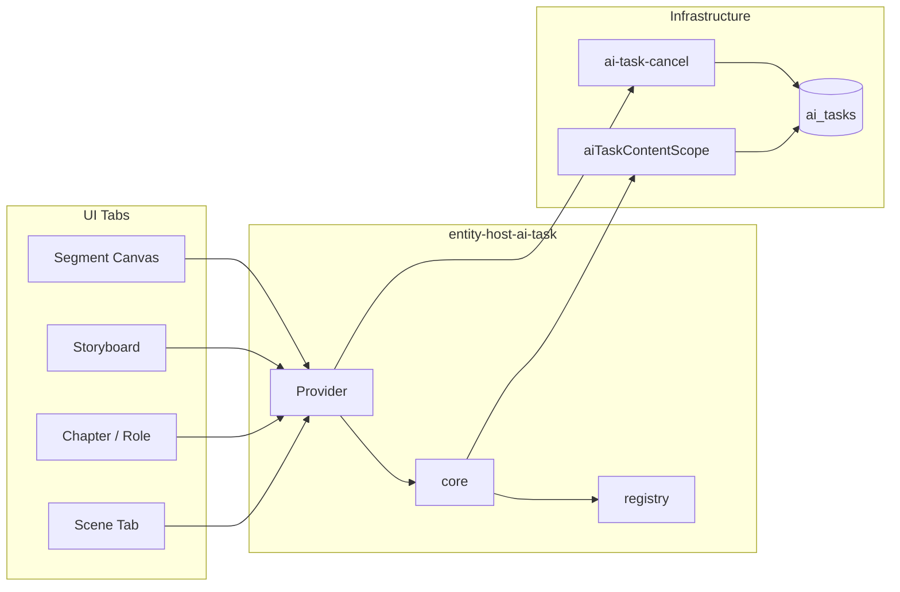

**文档时间**：2026-05-30T20:00:00+08:00

# SPEC · Entity Host AI Task — 全仓 AI 任务态通用架构（v1 终稿）

**文档性质**：**权威架构 SPEC** — 凡「AI 按钮 busy / 禁用 / 取消 / 切 Tab 仍识别 / 按实体不连坐」均以此为准。  
**产品阶段**：未上线 · **零兼容 · 不兜底 · 不保留并行实现**  
**优先级**：P0（平台能力，优先于各 Tab 局部修补）  

**下游执行 PLAN**（按 Phase 拆分，不得偏离本 SPEC）：

| Phase | 文档 | 范围 |
|-------|------|------|
| **主线** | `docs/dev/plans/20260530T203000+0800-TRACK-EntityHostAiTask全仓执行主线.md` | Phase 顺序、门禁、验收矩阵 |
| **P1** | `docs/dev/plans/20260530T180000+0800-PLAN-片段画布视频提示词SegmentHostAiTask与右栏UX-破坏性重构.md` | Segment 宿主 + 片段 BUG + 右栏 UX（**首个落地切片**） |
| **P2** | `docs/dev/plans/20260530T210000+0800-PLAN-EntityHostAiTask-Role与Scene宿主迁移.md` | Role / Scene / Chapter / Actor 宿主 + 删全局 busy |
| **P3** | `docs/dev/plans/20260530T220000+0800-PLAN-EntityHostAiTask-CI守卫与AGENTS索引固化.md` | CI grep 守卫 + AGENTS 索引 |

**关联**：

- `ui/src/domain/aiTaskContentScope/` — Host 键与 `ai_tasks` scope **对齐 SSOT**
- `ui/src/domain/ai-task-cancel/` — Cancel / RunView **L0 基础设施**
- `docs/dev/plans/20260528T150000+0800-PLAN-故事板分镜工作台按宿主粒度交互锁-破坏性重构.md` — 本产品意图的首个实例，由本 SPEC 吸收升格

---

## 0. 问题陈述与架构目标

### 0.1 产品意图（冻结）

用户在任意界面发起 AI 任务后：

1. **仅锁任务所属实体**（如角色 A 生图不影响角色 B；场次 A 规划故事板不影响场次 B；片段 A 生视频不影响片段 B）。
2. **切 Tab、关 Panel、F5 重启**后，busy 态仍可从 `ai_tasks` 恢复，禁止重复提交同实体同 kind。
3. **取消**与 **打开工作台/弹层查看** 在 running 时仍可用（按 surface 声明，非全局锁死）。

### 0.2 现状缺陷（必须根除）

| 反模式 | 典型代码 | 后果 |
|--------|----------|------|
| Tab 级 busy 标量 | `boardBusy`、`mergedBoardBusy` | 一场次任务锁全场次 UI |
| 全局 any-running | `anyRolePortraitRunning` | 一角色生图锁全部角色钮 |
| Panel local busy | `useState(optimizing)` | 切 Tab 丢态、可重复提交 |
| 平行 Map hook | `useSegmentVideoGeneration.activeTasks` | 与 lock 域重复、reconcile 不一致 |
| prop drilling | `isSegmentGenerating` 长链 | 漏传即失效 |

### 0.3 架构目标

| 原则 | 落地 |
|------|------|
| **高内聚** | 任务态索引、reconcile、inflight、surface 映射 **只**在 `entity-host-ai-task` |
| **低耦合** | UI 只读 `HostInteractionLock`；业务 Tab 不持有 Map |
| **可扩展** | 新 `ai_tasks.kind` = registry **一行** + surface 策略 **一行** + 单测 |
| **单一 SSOT** | Host 键与 `aiTaskContentScope` 同构；禁止第二套 id 解析 |

---

## 1. 全仓分层（冻结 · 不可增删层）

```
┌──────────────────────────────────────────────────────────────────┐
│ L2  UI 组件（各 Tab / Modal / Workbench）                         │
│     只读：lock.surfaces.* · lock.runViews.* · lock.primaryRunning│
│     只调：useHostAiTaskActions().submit* / requestCancel*         │
│     禁止：useState(busy) · any*Running · boardBusy 锁 AI 钮       │
└────────────────────────────┬─────────────────────────────────────┘
                             │ 单向依赖
┌────────────────────────────▼─────────────────────────────────────┐
│ L1  entity-host-ai-task/                                          │
│     runtime/EntityHostAiTaskProvider + hooks                      │
│     core/ 纯函数：resolve · buildLocks · reconcile · surfaces     │
│     registry/ kind 行 · host 解析 · surface 策略表                │
│     adapters/ 各业务 submit 编排（薄层，调 IPC）                   │
└────────────────────────────┬─────────────────────────────────────┘
                             │
┌────────────────────────────▼─────────────────────────────────────┐
│ L0  ai-task-cancel · aiTaskContentScope · aiTaskKinds · ai_tasks   │
│     （已有；Entity Host 不重复实现 cancel 协议）                    │
└──────────────────────────────────────────────────────────────────┘
```

**L2 允许的非 AI 禁用**（不得与 Entity Host 混用）：

- 连线拖拽、导入框架、表单校验失败、未选模型等 **本地 UX gate** → 命名 `*BlockReason` / `globalDisabled`，**禁止**命名 `*Busy` / `*Running`。

---

## 2. 模块根与目录（唯一方案）

### 2.1 路径

**唯一模块根**：`ui/src/domain/entity-host-ai-task/`

**迁移动作（P1 批次）**：

1. 将 `ui/src/domain/storyboard-segment-interaction-lock/` **整包迁入** `entity-host-ai-task/`，按 §2.2 重组目录。
2. **删除** `storyboard-segment-interaction-lock/`。
3. **删除** `ui/src/hooks/useSegmentVideoGeneration.ts`。
4. 全仓 import 一次性改为 `from ".../entity-host-ai-task"`。

**公开 API**：仅 `ui/src/domain/entity-host-ai-task/index.ts` export；**禁止** deep import。

### 2.2 目录结构（冻结）

```
ui/src/domain/entity-host-ai-task/
├── index.ts                          # 唯一对外 export
├── types.ts                          # HostKey · Lock · Surface · Registry 类型
├── registry/
│   ├── entityHostKindRegistry.ts     # ai_tasks.kind → HostKindMeta（全仓 SSOT）
│   └── surfacePolicyRegistry.ts      # reason × surface → locked（数据表）
├── core/
│   ├── parseTaskToHostKey.ts         # AiTaskListItem → HostKey | null
│   ├── resolveHostInteractionLock.ts # 单宿主纯函数 resolver
│   ├── buildHostLocksIndex.ts        # scope → HostLocksIndex 稀疏索引
│   ├── mapSurfacesFromReasons.ts     # 读 surfacePolicyRegistry
│   ├── reconcileRemoteRunningIndex.ts
│   └── inflightRegistryKey.ts
├── runtime/
│   ├── EntityHostAiTaskProvider.tsx
│   ├── useEntityHostAiTaskSync.ts    # progress 监听 + reconcile effect
│   ├── inflightRegistry.ts           # useEntityHostInflightRegistry（原 SegmentLocal）
│   └── progress/
│       └── segmentVideoProgressBridge.ts
├── hooks/
│   ├── useHostInteractionLock.ts     # UI 主入口
│   ├── useHostLocksIndex.ts          # 列表/画布稀疏索引
│   └── useHostAiTaskActions.ts       # begin/end inflight · execute* · cancel*
├── adapters/                         # 薄编排；禁止 UI import
│   ├── segmentVideoExecute.ts
│   ├── segmentVideoPromptOptimize.ts
│   └── openSegmentVideoWorkbench.ts
└── __tests__/                        # core + registry 单测
```

---

## 3. 核心模型

### 3.1 HostKey（与 aiTaskContentScope 对齐）

```ts
/** 任务锁粒度 · 与 ParsedRunningTaskScope / UiEditContext 同构 */
export type EntityHostKey =
  | { variant: "segment"; storyId: string; chapterNodeId: string; sceneNodeId: string; segmentNodeId: string }
  | { variant: "segment_node_only"; storyId: string; segmentNodeId: string }
  | { variant: "role"; storyId: string; roleNodeId: string; chapterNodeId?: string | null }
  | { variant: "scene"; storyId: string; chapterNodeId: string; sceneNodeId: string }
  | { variant: "scene_only"; storyId: string; sceneNodeId: string }
  | { variant: "chapter"; storyId: string; chapterNodeId: string }
  | { variant: "actor"; storyId: string; actorNodeId: string };
```

**规则**：

- `parseTaskToHostKey(task)` **唯一**解析入口；禁止 UI 读 `lastPayload` 拼 Map。
- `hostKeyStableId(key)` → string（用于 Map 键，如 `segment:${segmentNodeId}`、`role:${roleNodeId}`）。

**不在 Entity Host 内建模**（继续 L0 + 专用 gate）：

- `story_root` 批量、`story_batch_gate`、`settings_model_validate`、`clip_video`、prop/scene_asset_only。

### 3.2 RunningKind 与 Registry 行

```ts
export interface EntityHostKindRegistryEntry {
  /** 与 ai_tasks.kind 或 kindFilter 组一致 */
  kindFilter: string | readonly string[];
  /** 从 task 解析 HostKey 的策略 id（registry 内建） */
  hostKeyVariant: EntityHostKey["variant"];
  /** IPC 提交窗 inflight；无则 undefined */
  inflightKind?: string;
  /** L0 cancel 槽位 id（UI 布局用） */
  cancelSlot: string;
  /** 是否允许同宿主多 kind 并行（默认 true） */
  allowParallelKinds?: boolean;
}
```

**扩展流程（强制）**：

1. `entityHostKindRegistry.ts` 增加一行。  
2. `surfacePolicyRegistry.ts` 增加该 kind 触发的 surface 行。  
3. `aiTaskCancelRegistry` 已有 kind 则复用；无则同 PR 登记。  
4. `__tests__/registry.test.ts` + resolver 单测。  

**禁止**在 Tab 组件增加 `if (kind === "...") setBusy(true)`。

### 3.3 HostInteractionLock（UI 唯一消费结构）

```ts
export interface HostInteractionLock {
  hostKey: EntityHostKey;
  hostStableId: string;
  isLocked: boolean;
  reasons: HostLockReason[];           // running kind + local inflight
  surfaces: Record<HostLockSurface, boolean>;
  runViews: Record<string, AiTaskRunView>;  // key = cancelSlot
  primaryRunningTask: AiTaskListItem | null;
}
```

### 3.4 HostLockSurface（全仓统一枚举）

命名：`{domain}_{surface}`，避免 storyboard/segment 各搞一套。

```ts
export type HostLockSurface =
  // ── 通用 ──
  | "workbench_form"
  | "workbench_submit"
  | "panel_primary_action"      // 各 Panel 主 AI 钮（优化/生图/规划）
  | "panel_secondary_action"  // 保存/打开工作台等非立即 AI
  | "panel_form"              // textarea / 模型选择
  | "list_row_badge"          // 列表行 running 徽标（不禁用他行）
  | "canvas_structure"        // 画布结构编辑（删/拖/连线）
  | "canvas_open_workbench";   // 打开工作台/弹层 · 恒 false（INV-EHOST-06）
```

**Segment 切片映射（P1）**：

| 业务控件 | Surface |
|----------|---------|
| AI 优化提示词 | `panel_primary_action` |
| 保存提示词 | `panel_secondary_action` |
| 完整提示词 textarea | `panel_form` |
| 生成视频（打开工作台） | `panel_secondary_action`（open 不锁 · INV-EHOST-06 另管 canvas_open_workbench） |
| 视频工作台确认生成 | `workbench_submit` |
| 分镜生图 / 优化 | `workbench_form` / `workbench_submit` |
| 画布结构（故事板） | `canvas_structure` |

**Role 切片映射（P2）**：

| 业务控件 | Surface |
|----------|---------|
| 生成定妆照 | `panel_primary_action` |
| 角色列表行 | `list_row_badge` |

**Scene 切片映射（P2）**：

| 业务控件 | Surface |
|----------|---------|
| 生成场次分镜 / scene_shots_plan | `panel_primary_action` |
| 场次列表行 | `list_row_badge` |
| 故事板画布结构 | `canvas_structure`（**仅锁当前 scope 内 running 的 scene/chapter plan**） |

Surface 真值由 `surfacePolicyRegistry.ts` 驱动，`mapSurfacesFromReasons` 读表生成。

---

## 4. Runtime：EntityHostAiTaskProvider

### 4.1 挂载

`App.tsx`：**唯一** Provider，包裹 `VideoGenerationWorkbenchHost` + `TabRouter` 子树。

### 4.2 Context 值（窄接口）

```ts
interface EntityHostAiTaskContextValue {
  tasksLoadState: "idle" | "loading" | "ready";
  revision: number;  // inflight + reconcile 触发 UI
  getLock(hostKey: EntityHostKey): HostInteractionLock;
  getLocksInScope(scope: HostScopeFilter): HostLocksIndex;
  inflight: EntityHostInflightRegistry;
}
```

`storyAiTasks` **不**暴露给 UI；由 Provider 内部注入 sync hook。

### 4.3 useEntityHostAiTaskSync（内聚职责）

| 职责 | 说明 |
|------|------|
| Hydrate | `tasksLoadState === "ready"` 时从 `storyAiTasks` 重建 remote index |
| Progress | `segment_video_progress` 等 **注册表声明**的 channel |
| Reconcile | 调用 `reconcileRemoteRunningIndex`；**ready 前零删除** |
| Inflight | `beginInflight(hostStableId, kind)` / `endInflight(..., generation)` |

### 4.4 Hooks（L2 唯一入口）

```ts
/** 单宿主（右栏、工作台、Modal 内） */
function useHostInteractionLock(hostKey: EntityHostKey | null): HostInteractionLock;

/** 列表/画布稀疏索引（场次列表、角色列表、segment 画布） */
function useHostLocksIndex(filter: HostScopeFilter): HostLocksIndex;

/** 提交/取消（禁止 UI 直调 requestAiTaskCancel，除 AiTaskCancelButton 内部） */
function useHostAiTaskActions(): {
  beginInflight: (...);
  endInflight: (...);
  executeSegmentVideo: (...);
  executeSegmentVideoPromptOptimize: (...);
  executeRolePortrait: (...);       // P2
  executeSceneShotsPlan: (...);      // P2
  requestCancelForSlot: (hostKey, cancelSlot) => Promise<void>;
};
```

---

## 5. Reconcile 与 Inflight（全 kind 统一）

### 5.1 双态模型

| 态 | 来源 | 生命周期 |
|----|------|----------|
| **Remote running** | `ai_tasks.state === "running"` | 至终态 / reconcile |
| **Local inflight** | `beginInflight` ~ IPC 返回 / progress 首事件 | 至 `endInflight` 或 remote 接管 |

**查询 busy**：`remoteRunning(host) || localInflight(host, kind)`。

### 5.2 删除 remote index 条件（须同时满足）

1. `tasksLoadState === "ready"`  
2. 且（progress 终态 **或** task 行 `state !== "running"`）  
3. 且非 inflight 窗口  

**禁止**：`storyAiTasks.length === 0` 时批量 delete。

### 5.3 Cancel

- **禁止** cancel 响应返回后立即清 index（INV-EHOST-04）。  
- **禁止** IPC 成功立即清 remote index（INV-EHOST-05）；仅 `endInflight`。

---

## 6. 全仓 kind → Host 注册表（v1 冻结清单）

| kind（组） | Host variant | inflight | cancelSlot | Phase |
|------------|--------------|----------|------------|-------|
| `segment_storyboard_image` | segment | ✓ | shotImage | P1 |
| `optimize_storyboard_shot_prompt` | segment | ✓ | promptOptimize | P1 |
| `segment_video` / `_base` / `_lipsync` | segment_node_only | ✓ | video | P1 |
| `segment_video_prompt_optimize` | segment_node_only | ✓ | segmentVideoPromptOptimize | P1 |
| `segment_video_prompt_compress` | segment_node_only | — | segmentVideoPromptCompress | P1 |
| `role_portrait` | role | ✓ | rolePortrait | P2 |
| `role_portrait_prompt_ai` / `_chapter` | role | ✓ | rolePromptAi | P2 |
| `scene_shots_plan` | scene | ✓ | sceneShotsPlan | P2 |
| `chapter_scenes_plan` | chapter | ✓ | chapterScenesPlan | P2 |
| `scene_concept_image` | scene_only | ✓ | sceneConcept | P2 |
| `cast_portrait_still` / `actor_portrait` | actor | ✓ | actorPortrait | P2 |

**批量 kind**（`story_scenes_shots_plan_batch` 等）：不进入 Host index；使用 **`story_batch_gate`** Context + 专用 Modal lock（与 Entity Host **正交**）。

---

## 7. 废止清单（全仓 grep 清零）

| 废止符号 | 替代 |
|----------|------|
| `anyRolePortraitRunning` | `useHostLocksIndex` + per-row surface |
| `boardBusy` 锁 AI 钮 / 锁画布 | `useHostInteractionLock(sceneKey).surfaces.*` |
| `mergedBoardBusy` 锁单镜工作台 submit | segment host lock |
| `isSegmentGenerating` prop 链 | `useHostInteractionLock` |
| `useSegmentVideoGeneration` | `useHostAiTaskActions` |
| `optimizing` useState | `surfaces.panel_primary_action` |
| `roleGenLoadingId` 作跨角色锁 | 仅作同角色 IPC 窗 inflight |
| `segMediaBusy` / `workbenchInteractionLocked` 聚合 | host lock surfaces |

---

## 8. UI 契约（L2 强制）

### 8.1 按钮 disabled

```tsx
// ✅
const lock = useHostInteractionLock(segmentHostKey);
<Btn variant="ai" disabled={lock.surfaces.panel_primary_action || !modelReady} />

// ❌
<Btn disabled={optimizing || anyRolePortraitRunning || boardBusy} />
```

### 8.2 列表行 running 徽标

```tsx
const index = useHostLocksIndex({ storyId, scope: "role" });
const rowLock = index.get(roleNodeId);
{rowLock?.isLocked ? <RunningBadge /> : null}
// 他行按钮不禁用
```

### 8.3 Cancel

- 每 **cancelSlot** 最多一个 `AiTaskCancelButton`，数据来自 `lock.runViews[cancelSlot]`。  
- 同宿主多 kind 并行 → 多 cancel 钮（故事板 PLAN 已冻结）。

### 8.4 色调（不变）

- 直接发 AI → `variant="ai"`  
- 打开工作台 / 保存 → `variant="primary"`  

---

## 9. 与现有模块关系



- **`ai-task-cancel`**：不合并进 Entity Host；Host 只 **组合** `deriveAiTaskRunView`。  
- **`aiTaskContentScope`**：HostKey 解析 **委托**其 `parseRunningTaskToScope`，再 map 到 `EntityHostKey`。  
- **业务 open 管道**（如 `openSegmentVideoWorkbench`）：放在 `adapters/`，内部可调 handoff，**不**写入 lock 模块 core。

---

## 10. 分 Phase 交付（唯一路线图）

| Phase | 交付 | 验收 |
|-------|------|------|
| **P1** | 模块根建立 + Segment kinds + Provider + 片段 BUG + 右栏 UX | `20260530T180000` PLAN 全部 checkbox |
| **P2** | Role + Scene + Chapter + Actor kinds；删 `anyRolePortraitRunning` / `boardBusy` AI 锁 | 两角色并发生图；两场次并行 plan |
| **P3** | AGENTS.md 索引；CI grep 守卫脚本 `check-no-global-ai-busy.ps1` | 废止符号 CI 失败；见 P3 PLAN |

**P1 模块命名**：对外统一 `entity-host-ai-task`；**禁止**再引入 `segment-host-ai-task` 第二目录。

---

## 11. 不变式（INV-EHOST · 合并入 AGENTS）

| ID | 条文 |
|----|------|
| INV-EHOST-01 | 禁止 Panel `useState` 表示跨导航 AI busy |
| INV-EHOST-02 | `tasksLoadState !== "ready"` 禁止 reconcile 删除 |
| INV-EHOST-03 | 多入口 open 工作台必须走 adapters 唯一函数 |
| INV-EHOST-04 | cancel 禁止乐观清 remote index |
| INV-EHOST-05 | IPC 成功仅 endInflight |
| INV-EHOST-06 | `canvas_open_workbench` 恒 false |
| INV-EHOST-07 | 新 kind 必须 registry 登记，禁止 UI 硬编码 |
| INV-EHOST-08 | UI 禁止 import `adapters/` 以外路径发起 IPC AI |

---

## 12. CI 守卫（P3 必做）

脚本 `scripts/check-no-global-ai-busy.ps1` 失败条件（示意）：

- 业务目录出现 `anyRolePortraitRunning`  
- 出现 `disabled={*boardBusy*` 与 AI 按钮同行  
- 出现 `useState(*optimizing` 在 segment/role/scene 路径  
- 出现 `from ".../useSegmentVideoGeneration"`  

---

## 13. 修订下游 PLAN（已完成）

| 文档 | 状态 |
|------|------|
| `20260530T180000+0800-PLAN-…` | 模块根 `entity-host-ai-task/`；Track T0–T6；surface 与 SPEC 对齐 |
| `20260530T210000+0800-PLAN-…` | Role/Scene/Chapter/Actor；boardBusy 拆分 |
| `20260530T220000+0800-PLAN-…` | CI + AGENTS |
| `20260530T203000+0800-TRACK-…` | 全仓执行主线 |

类型名 `SegmentHost*` 在 P1 可保留 **模块内** alias；对外 export 统一 `Host*` / `EntityHost*`；P2 删除 Segment 前缀 alias。

---

**文档结束 · v1 终稿**
